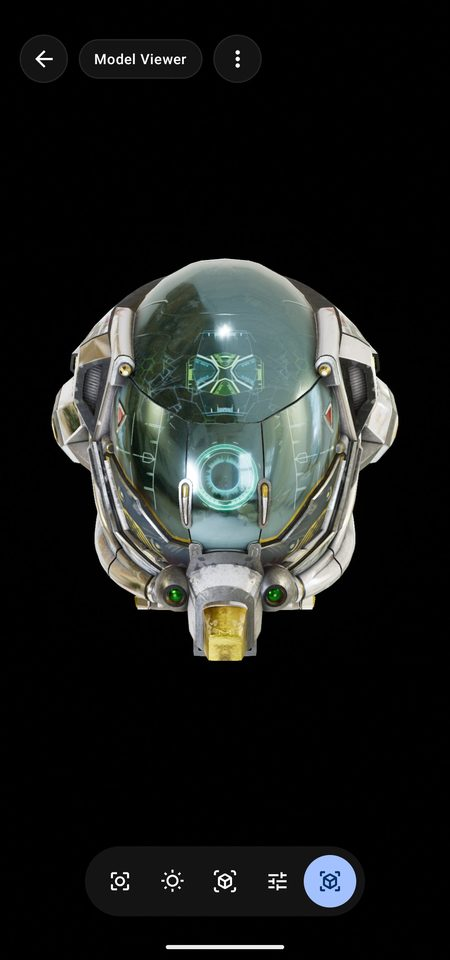
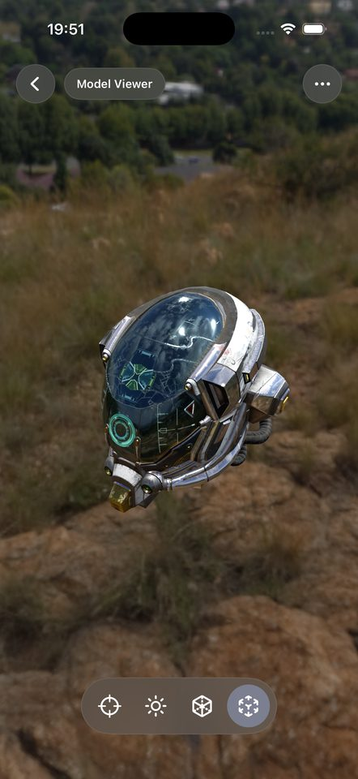
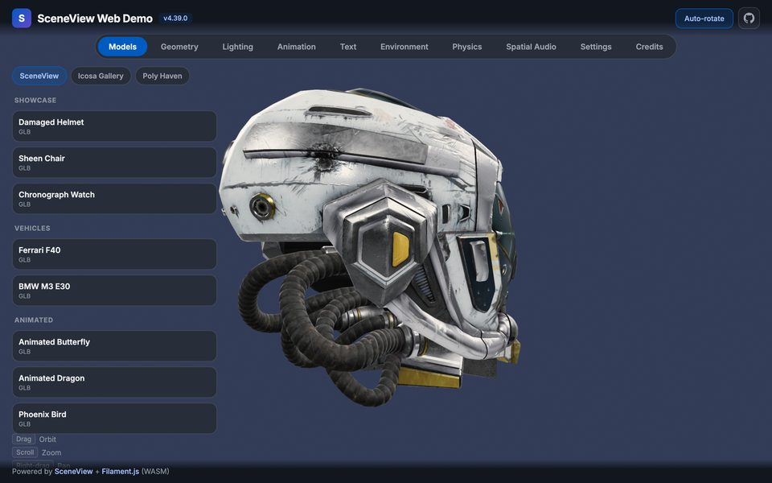

# SceneView

> **The AI-first 3D & AR SDK for Jetpack Compose, SwiftUI and the web.**

Declarative 3D and AR for app developers who want a model on screen, or in the room, without a
game engine: Filament + ARCore on Android, RealityKit + ARKit on Apple, Filament.js + WebXR in the
browser — with Flutter, React Native and Compose Multiplatform bridges on top. Open source,
Apache 2.0.

**AI-first** means one thing here: an assistant that reads [`llms.txt`](./llms.txt) or
[the MCP server](./mcp/) writes SceneView code that works on the first try. When it doesn't, the
API or the doc gets fixed.

<!-- Platforms -->
[](https://central.sonatype.com/artifact/io.github.sceneview/sceneview)
[](https://central.sonatype.com/artifact/io.github.sceneview/arsceneview)
[](https://github.com/sceneview/sceneview)
[](https://www.npmjs.com/package/sceneview-web)
[](https://pub.dev/packages/flutter_sceneview)
[](https://www.npmjs.com/package/@sceneview-sdk/react-native)
[](https://www.npmjs.com/package/sceneview-mcp)

<!-- Status -->
[](https://github.com/sceneview/sceneview/actions/workflows/ci.yml)
[](https://github.com/sceneview/sceneview/blob/main/LICENSE)
[](https://github.com/sceneview/sceneview)
[](https://discord.gg/UbNDDBTNqb)
[](https://opencollective.com/sceneview)

---

## Quick start

One minimal, working example per platform. The full reference for each is in
[`llms.txt`](./llms.txt).

### Android

```kotlin
// build.gradle.kts
implementation("io.github.sceneview:sceneview:4.40.0")
```

```kotlin
@Composable
fun ModelScreen() {
    SceneView(modifier = Modifier.fillMaxSize()) {          // orbit camera + default lighting
        rememberModelInstance(modelLoader, "models/helmet.glb")?.let { instance ->
            ModelNode(modelInstance = instance, scaleToUnits = 1.0f, autoAnimate = true)
        }
    }
}
```

`models/helmet.glb` lives in `src/main/assets/`. `rememberModelInstance` returns `null` until the
model is loaded, then recomposes. Never call `modelLoader.createModel*` from a background
coroutine: Filament calls must run on the main thread, and `rememberModelInstance` handles that.

### AR (Android)

```kotlin
// build.gradle.kts
implementation("io.github.sceneview:arsceneview:4.40.0")   // includes the 3D module
```

```kotlin
@Composable
fun ARScreen() {
    var anchor by remember { mutableStateOf<Anchor?>(null) }

    ARSceneView(
        modifier = Modifier.fillMaxSize(),
        planeRenderer = true,
        onSessionUpdated = { _, frame ->
            if (anchor == null) {
                anchor = frame.getUpdatedPlanes()
                    .firstOrNull { it.type == Plane.Type.HORIZONTAL_UPWARD_FACING }
                    ?.let { frame.createAnchorOrNull(it.centerPose) }
            }
        }
    ) {
        val helmet = rememberModelInstance(modelLoader, "models/helmet.glb")
        anchor?.let { a ->
            AnchorNode(anchor = a) {
                helmet?.let { ModelNode(modelInstance = it, scaleToUnits = 0.5f) }
            }
        }
    }
}
```

Plane detected → `anchor` set → Compose recomposes → the model appears. **AR state is just Kotlin
state.** For placement without a tap, grounded and gesture-ready, start from
`AutoPlacementScene` (see [`llms.txt`](./llms.txt)).

### iOS / macOS / visionOS (SwiftUI)

Swift Package Manager: `https://github.com/sceneview/sceneview.git`, from `4.39.0`.

```swift
import SwiftUI
import SceneViewSwift

struct ModelScreen: View {
    @State private var model: ModelNode?

    var body: some View {
        SceneView { root in
            if let model { root.addChild(model.entity) }
        }
        .contentID(model != nil)      // re-run the builder once the model has loaded
        .environment(.studio)
        .cameraControls(.orbit)
        .task { model = try? await ModelNode.load("helmet.usdz") }
    }
}
```

The content closure runs once unless its `.contentID(_:)` changes: without that line, a model
that finishes loading after the scene appears is never added.

### Web

```html
<canvas id="viewer" style="width: 100%; height: 480px"></canvas>
<script src="https://cdn.jsdelivr.net/gh/sceneview/sceneview@v4.40.0/website-static/js/filament/filament.js"></script>
<script src="https://cdn.jsdelivr.net/gh/sceneview/sceneview@v4.40.0/website-static/js/sceneview.js"></script>
<script> SceneView.modelViewer("viewer", "model.glb") </script>
```

### Compose Multiplatform (Android · iOS · desktop)

```kotlin
// commonMain dependencies
implementation("io.github.sceneview:sceneview-compose:4.40.0")
```

```kotlin
SceneViewer(model = ModelSource.Asset("models/helmet.glb"), modifier = Modifier.fillMaxSize())
```

A viewer by design — load, orbit, light, tap; no AR. Scope and the one-time iOS setup:
[`sceneview-compose/`](sceneview-compose/README.md).

### Flutter

```dart
// pubspec.yaml → flutter_sceneview: ^4.39.0
final controller = SceneViewController();

SceneView(
  controller: controller,
  onViewCreated: () => controller.loadModel(
    const ModelNode(modelPath: 'models/helmet.glb'),
  ),
)
```

### React Native

```tsx
// npm install @sceneview-sdk/react-native
import { SceneView } from '@sceneview-sdk/react-native';

<SceneView
  style={{ flex: 1 }}
  modelNodes={[{ src: 'models/helmet.glb', position: [0, 0, -2] }]}
  cameraControlMode="orbit"
/>
```

Flutter and React Native bridge a subset of the native API — see
[`flutter/`](flutter/sceneview_flutter/README.md) and
[`react-native/`](react-native/react-native-sceneview/README.md) for what is covered.

### Your AI assistant

```bash
claude mcp add sceneview -- npx -y sceneview-mcp   # Claude Code
codex  mcp add sceneview -- npx -y sceneview-mcp   # Codex
```

Then ask: *"Add a 3D model viewer to my Compose screen."* Every other client is in
[Use with AI](#use-with-ai).

---

## Try it

<p>
  <a href="https://play.google.com/store/apps/details?id=io.github.sceneview.demo"></a>&nbsp;
  <a href="https://apps.apple.com/us/app/sceneview/id6761329763"></a>&nbsp;
  <a href="https://sceneview.github.io/playground.html"></a>
</p>

The demo apps are built from [`samples/`](samples/). Any demo opens straight from a link:
`https://sceneview.github.io/open?demo=<id>` (for example `…/open?demo=ar-rerun`).

---

## Runs on

Each row is a published package plus an app or page you can open today, backed by a real
capture of it.

| Platform | Status | Install | Open it | Capture |
|---|---|---|---|---|
| **Android** | Shipped · Stable | [Maven Central](https://central.sonatype.com/artifact/io.github.sceneview/sceneview) | [Google Play](https://play.google.com/store/apps/details?id=io.github.sceneview.demo) |  |
| **iOS** | Shipped · Alpha | [Swift Package](SceneViewSwift/) | [App Store](https://apps.apple.com/us/app/sceneview/id6761329763) |  |
| **Web** | Shipped · Alpha | [npm `sceneview-web`](https://www.npmjs.com/package/sceneview-web) | [Live web demo](https://sceneview.github.io/web-demo/) |  |

*Shipped* means released and publicly reachable; the second word is the API maturity.
The other platforms in the table below join this section once a capture backs them.

---

## Platforms

| Platform | Renderer | Framework | Status |
|---|---|---|---|
| **Android** | Filament | Jetpack Compose | Stable |
| **Android TV** | Filament | Compose TV | Alpha |
| **iOS / macOS / visionOS** | RealityKit | SwiftUI | Alpha |
| **Web** | Filament.js (WebGL2 / WASM) | JavaScript + Kotlin/JS | Alpha |
| **Compose Multiplatform** | Filament (Android, desktop) · RealityKit (iOS) | `sceneview-compose` | Alpha — viewer subset |
| **Desktop (JVM)** | Filament, via filament-kmp | Compose Desktop (`sceneview-compose`) | Alpha |
| **Flutter** | Native per platform | PlatformView | Alpha |
| **React Native** | Native per platform | Fabric | Alpha |
| **AI assistants** | — | `llms.txt`, MCP server, skills | Stable |

## Install

| Platform | Coordinate |
|---|---|
| Android 3D | `io.github.sceneview:sceneview:4.40.0` |
| Android AR | `io.github.sceneview:arsceneview:4.40.0` |
| Compose Multiplatform | `io.github.sceneview:sceneview-compose:4.40.0` |
| KMP core only (math, collision, physics) | `io.github.sceneview:sceneview-core:4.40.0` |
| Apple (SPM) | `https://github.com/sceneview/sceneview.git`, from `4.39.0` |
| Web, script tag | the two `<script>` tags in [Web](#web) |
| Web, bundler (Kotlin/JS) | `npm install sceneview-web` — see [SceneView Web](#sceneview-web) |
| Flutter | [`flutter_sceneview`](https://pub.dev/packages/flutter_sceneview) on pub.dev |
| React Native | [`@sceneview-sdk/react-native`](https://www.npmjs.com/package/@sceneview-sdk/react-native) on npm |
| AI assistants | `npx -y sceneview-mcp` — see [Use with AI](#use-with-ai) |

---

## Use with AI

Everything an assistant needs to write SceneView code ships with the SDK:

- **[`llms.txt`](./llms.txt)** — the complete API reference in one file: composables, every node
  type, threading rules, recipes. Its Kotlin snippets are compiled in CI. Served at
  `https://sceneview.github.io/llms.txt` for tools without MCP support.
- **Rules files** — `AGENTS.md` (Codex, Cursor, GitHub Copilot, Gemini in Android Studio and
  others), `CLAUDE.md` (Claude Code), `.github/copilot-instructions.md`, and `.cursorrules` for
  older Cursor versions.
- **The [MCP server](./mcp/)** — free, no API key. The tools assistants reach for most:
  `validate_code` (checks a snippet against the real public API before you run it),
  `get_node_reference` (the exact node signature, not an invented one), `list_samples` /
  `get_sample` (38 samples to start from), and `get_setup` / `get_ar_setup` (project wiring).

### MCP setup

```bash
claude mcp add sceneview -- npx -y sceneview-mcp   # Claude Code
codex  mcp add sceneview -- npx -y sceneview-mcp   # Codex
copilot mcp add sceneview -- npx -y sceneview-mcp  # GitHub Copilot CLI
```
```json
// Cursor (.cursor/mcp.json), Cline, JetBrains AI Assistant
{ "mcpServers": { "sceneview": { "command": "npx", "args": ["-y", "sceneview-mcp"] } } }
// VS Code (.vscode/mcp.json) uses the "servers" key instead
{ "servers": { "sceneview": { "type": "stdio", "command": "npx", "args": ["-y", "sceneview-mcp"] } } }
```

Clients that only speak HTTP (Gemini in Android Studio, ChatGPT) use the hosted endpoint
`https://mcp.sceneview.dev/mcp`, or run their own with `npx sceneview-mcp --http`. Per-client
snippets: [sceneview.github.io/#ai-setup](https://sceneview.github.io/#ai-setup). Listed on the
[MCP Registry](https://registry.modelcontextprotocol.io).

### ChatGPT / Codex plugin

This repository is also an OpenAI plugin: `.codex-plugin/plugin.json` points at the three
skills under [`agents/`](agents/) (`sceneview`, `sceneview-ios`, `sceneview-web`). From a
checkout:

```bash
codex plugin marketplace add "$PWD"    # absolute path — a relative one does not resolve
codex plugin add sceneview@sceneview-local
```

Codex also discovers the skills from `.agents/skills/` on its own. Over HTTP the MCP server
carries an inline `view_3d_model` widget that renders a public GLB/glTF URL in the
conversation. Listing copy and test prompts: [agents/OPENAI-PLUGIN.md](agents/OPENAI-PLUGIN.md).

### Claude Code plugin

`/plugin marketplace add sceneview/claude-marketplace`, then `/plugin install sceneview@sceneview`,
installs the MCP server together with the contributor commands used to work on this repository —
see [sceneview/claude-marketplace](https://github.com/sceneview/claude-marketplace).

Vertical MCP servers (Rerun AR debugging and others) are listed in the [MCP README](./mcp/README.md).

---

## Android in depth

### 3D scene

`SceneView` is a composable that renders a Filament viewport. Nodes are composables inside it.

```kotlin
val engine = rememberEngine()
val modelLoader = rememberModelLoader(engine)
val environmentLoader = rememberEnvironmentLoader(engine)

SceneView(
    modifier = Modifier.fillMaxSize(),
    engine = engine,
    modelLoader = modelLoader,
    environment = rememberEnvironment(environmentLoader) {
        environmentLoader.createHDREnvironment("envs/studio.hdr")
            ?: createEnvironment(environmentLoader)
    },
    cameraManipulator = rememberCameraManipulator()
) {
    // Model — async loaded, appears when ready
    rememberModelInstance(modelLoader, "models/helmet.glb")?.let {
        ModelNode(modelInstance = it, scaleToUnits = 1.0f, autoAnimate = true)
    }

    // Geometry — procedural shapes
    CubeNode(size = Size(0.2f))
    SphereNode(radius = 0.1f, position = Position(x = 0.5f))

    // Nesting — same as Column { Row { } }
    Node(position = Position(y = 1.0f)) {
        LightNode(apply = { type(LightManager.Type.POINT); intensity(50_000f) })
        CubeNode(size = Size(0.05f))
    }
}
```

### Node composables — 27 in 3D, 15 more in AR

| Category | Nodes | What they do |
|---|---|---|
| **Models** | `ModelNode` | glTF/GLB with skeletal/morph animations. `isEditable = true` for gestures. |
| **Primitives** | `CubeNode` · `SphereNode` · `CylinderNode` · `ConeNode` · `TorusNode` · `CapsuleNode` · `TubeNode` · `PlaneNode` | Procedural geometry, parametric size/segments |
| **Curves & shapes** | `LineNode` · `PathNode` · `ShapeNode` | Single segments, polylines, extruded 2D polygons |
| **Custom geometry** | `MeshNode` | Your own Filament `VertexBuffer` / `IndexBuffer` |
| **Surfaces** | `ImageNode` · `VideoNode` · `BillboardNode` | PNG/JPG plane, video plane (MediaPlayer), camera-facing sprite |
| **3D text** | `TextNode` | World-space text label that always faces the camera |
| **Compose-in-3D** | `ViewNode` | Any Compose UI rendered as a 3D surface, fully touch-interactive |
| **Gaussian splats** | `SplatNode` | Render a Gaussian-splat capture |
| **Lighting & sky** | `LightNode` · `ReflectionProbeNode` · `DynamicSkyNode` · `FogNode` | Sun/dir/point/spot lights, local IBL, time-of-day sky, atmospheric fog |
| **Physics** | `PhysicsNode` | Simple rigid-body simulation (gravity, collisions) |
| **Cameras** | `CameraNode` · `SecondaryCamera` | Main and picture-in-picture cameras |
| **Group** | `Node` | Empty pivot for nesting and transform inheritance |

### AR scene

`ARSceneView` is `SceneView` with ARCore: the camera follows real-world tracking. See the
[AR quick start](#ar-android) above.

| Node | What it does |
|---|---|
| `AnchorNode` | Pin a node to a real-world ARCore `Anchor` |
| `HitResultNode` · `DepthHitResultNode` | Live surface cursor from each frame's hit-test (planes or depth) |
| `PoseNode` | Position a node at any ARCore `Pose` |
| `PlaneNode` · `ReticleNode` | Render a detected plane, or a placement reticle |
| `PointCloudNode` · `DepthMeshNode` · `SceneMeshNode` | Feature points, depth mesh, classified geospatial scene mesh |
| `AugmentedImageNode` | Image tracking — pose + 2D extent of a detected image |
| `AugmentedFaceNode` | Face mesh overlay (front camera) |
| `CloudAnchorNode` | Persistent cross-device anchor (host + resolve) |
| `StreetscapeGeometryNode` | **Geospatial** — semantic city mesh (buildings, terrain) |
| `TerrainAnchorNode` | **Geospatial** — anchor pinned to ground at a lat/lng |
| `RooftopAnchorNode` | **Geospatial** — anchor pinned to a building rooftop |

| Feature | API surface |
|---|---|
| **Automatic placement** | `AutoPlacementScene` + `AutoPlacementModel` — grounded, gesture-ready, no tap |
| **Plane / depth / instant placement** | `ARSceneView(planeRenderer = …, depthMode = …, instantPlacementMode = …)` |
| **Geospatial (VPS)** | `Streetscape` + `Terrain` + `Rooftop` anchors via `Earth` session |
| **Cloud Anchors** | `CloudAnchorNode.host(ttlDays = N)` + `.resolve(id)` |
| **Augmented Faces & Images** | `AugmentedFaceNode`, `AugmentedImageDatabase`, runtime image add |
| **Image Stabilization (EIS)** | `ARSceneView(imageStabilizationMode = ImageStabilizationMode.EIS)` |
| **Camera exposure & focus** | `ARSceneView(cameraConfig = …)`, `ARSceneScope.exposureCompensation` |
| **Record & Replay** | `rememberARRecorder()` to capture, `ARSceneView(playbackDataset = file)` to replay 1:1 — see [AR debugging](#ar-debugging) |
| **Rerun.io live debug** | `rememberRerunBridge()` streams poses, planes and point clouds to the Rerun viewer |
| **Permission flow** | `ARPermissionHandler` — auto-detected from `ComponentActivity` |

### Capabilities

| Capability | What it gives you | Where it lives |
|---|---|---|
| **Gestures** | Drag, pinch-to-scale, two-finger rotate, elevate, tap. Per-node opt-in via `isEditable`. | `NodeGestureDelegate`, `OnGestureListener` |
| **Animations** | Skeletal/morph from glTF, plus per-node spring/property/smooth-transform. | `ModelNode.playAnimation()`, `NodeAnimationDelegate` |
| **Physics** | Rigid-body dynamics — gravity, collisions, impulses. Pure Kotlin Multiplatform, no JNI. | `PhysicsNode`, `sceneview-core` |
| **Collision & raycasting** | Ray vs box / sphere intersections, hit-testing, frustum culling. | `CollisionSystem`, `Ray`, `Box`, `Sphere` |
| **Procedural geometry** | Cube/sphere/cylinder/cone/torus/capsule generators, extrusion from 2D shapes (Earcut + Delaunator). | `sceneview-core` geometry + triangulation |
| **HDR environment** | IBL lighting + skybox from `.hdr` / `.ktx`. Async load + reactive swap. | `EnvironmentLoader`, `rememberEnvironment` |
| **Custom materials** | Filament `.filamat` materials with parameters, plus built-in unlit / lit / overlay variants. | `MaterialLoader` |
| **Post-processing** | Bloom, depth of field, SSAO, vignette, color grading, tone mapping. | `View.bloomOptions`, `dynamicResolutionOptions`, … |
| **Compose UI in 3D** | Any `@Composable` as a textured plane in world space. Touches are forwarded, so `Button.onClick`, ripples and inner scrolling work. | `ViewNode` + `ViewNode.WindowManager` |
| **Multiple cameras** | Picture-in-picture, mini-map, security-camera views. | `SecondaryCamera` |
| **Reactive scene graph** | Change state → the tree updates. No imperative `parent.addChild()`. | `SceneScope` / `ARSceneScope` DSL |

---

## Model formats

| Format | Android | Apple | Web |
|---|---|---|---|
| glTF / GLB | ✅ | ✅ | ✅ |
| USDZ / Reality | — | ✅ RealityKit | — |
| STL (binary + ASCII) | ✅ converted to GLB in memory | — | — |
| OBJ + MTL | ✅ converted to GLB, material colours | — | — |
| PLY (binary + ASCII) | ✅ converted to GLB, vertex colours | — | — |
| 3MF | ✅ converted to GLB, declared units honoured | — | — |

There is no per-format API on Android: `rememberModelInstance(modelLoader, path)` accepts all of
them. The format is decided by the file's bytes, not its extension, so a file shared into your
app as `application/octet-stream` with no name still opens. The converters are dependency-free
Kotlin in `sceneview-core`. Tracked next:
[one `ModelFormat` entry point](https://github.com/sceneview/sceneview/issues/3489) and
[every format on the web](https://github.com/sceneview/sceneview/issues/3491). Details:
[Model formats](https://sceneview.github.io/docs/formats/).

---

## Apple (iOS / macOS / visionOS)

Native Swift Package built on RealityKit, with a node set mirroring the Android API. Content you
can build synchronously uses the `@NodeBuilder` form:

```swift
SceneView {
    GeometryNode.cube(size: 0.1, color: .blue)
        .position(.init(x: 0.5, y: 0, z: 0))
    LightNode.directional(intensity: 1000)
}
.environment(.studio)
.cameraControls(.orbit)
```

AR on iOS — tap a detected plane to place content:

```swift
ARSceneView(
    planeDetection: .horizontal,
    onTapOnPlane: { position, arView in
        let anchor = AnchorNode.world(position: position)
        anchor.add(GeometryNode.cube(size: 0.1, color: .blue).entity)
        arView.scene.addAnchor(anchor.entity)
    }
)
```

**Nodes** — `ModelNode` · `GeometryNode` (cube/sphere/cylinder/cone/torus/capsule/plane) ·
`LightNode` · `ImageNode` · `VideoNode` · `TextNode` · `ViewNode` · `BillboardNode` · `MeshNode` ·
`LineNode` · `PathNode` · `ShapeNode` · `PhysicsNode` · `ReflectionProbeNode` · `DynamicSkyNode` ·
`FogNode` · `CameraNode` · `AnchorNode` · `AugmentedImageNode` · `SceneReconstructionNode`
(visionOS scene mesh). Plus an iOS `RerunBridge` with the same wire format as Android.

Full guide: [SceneViewSwift/README.md](SceneViewSwift/README.md).

---

## SceneView Web

Two `<script>` tags and one call (see [Web](#web) above). The wrapper is ~24 KB gzipped; the
engine it drives is Filament — the same renderer as Android SceneView — compiled to WebAssembly
(~2.3 MB gzipped).

**JavaScript API (script tag):**
- `SceneView.modelViewer(canvasOrId, url, options?)` — all-in-one viewer with orbit + auto-rotate
- `SceneView.create(canvasOrId, options?)` — empty viewer, load a model later
- `viewer.loadModel(url)` — load or replace a glTF/GLB model
- `viewer.setAutoRotate(enabled)` — toggle rotation
- `viewer.dispose()` — release resources

**Kotlin/JS (`sceneview-web`, npm only)** — the power-user API: `OrbitCameraController`, the
geometry DSL, reactive node updates, and **WebXR** through `ARSceneView` (`immersive-ar`,
hit-test, anchors, light estimation), `VRSceneView` (`immersive-vr`, controllers) and the
low-level `WebXRSession`. The module builds a webpack bundle, so it has no Maven coordinate:

```bash
npm install sceneview-web
```

The package expects a `Filament` global and does not include the `SceneView.modelViewer` script
helpers. A Kotlin Multiplatform project that only needs the shared core (collision, math,
geometry, animation, physics — no renderer) uses
`implementation("io.github.sceneview:sceneview-core-js:4.40.0")`.

[Landing page](https://sceneview.github.io/) · [Playground](https://sceneview.github.io/playground.html) · [npm](https://www.npmjs.com/package/sceneview-web)

---

## The Compose-native successor to Sceneform

Google [archived Sceneform](https://github.com/google-ar/sceneform-android-sdk) in 2021 and ships
no first-party declarative AR renderer. SceneView descends from the maintained Sceneform
community fork: ARCore for perception, Filament for rendering, Jetpack Compose for the API, and
glTF (`.glb` / `.gltf`) instead of the deprecated `.sfb` format.

Coming from Sceneform? The [migration guide](https://sceneview.github.io/docs/migration/) maps it
concept by concept (`ArFragment` → `ARSceneView { }`, `ModelRenderable` →
`rememberModelInstance`, and so on).

---

## AR debugging

- **Record & Replay** — capture an ARCore session once with `rememberARRecorder()`, replay it 1:1
  at your desk with `ARSceneView(playbackDataset = file)`. See
  [`docs/docs/ar-recording.md`](docs/docs/ar-recording.md) and the
  [Record & Playback demo](samples/android-demo/RECORDING_PLAYBACK.md).
- **Hosted Rerun viewer** — tap **Save & Share** in the AR Rerun demo, host the `.rrd` file on
  any public URL, and open `https://sceneview.github.io/rerun/?url=<encoded-url>` to scrub the
  session frame by frame in a browser, with no local install. Architecture and the Kotlin API
  (`RerunBridge.requestSaveAndShare`) are in the *AR Debug — Rerun.io* section of
  [`llms.txt`](./llms.txt).

---

## Architecture

Each platform uses its **native renderer**. Shared logic lives in Kotlin Multiplatform.

```
sceneview-core (Kotlin Multiplatform)
├── math, collision, geometry, physics, animation, model-format converters
│
├── sceneview (Android)          → Filament + Jetpack Compose
├── arsceneview (Android)        → ARCore
├── sceneview-compose (KMP)      → one SceneViewer for Android, iOS and desktop
├── SceneViewSwift (Apple)       → RealityKit + SwiftUI
├── sceneview-web (Web)          → Filament.js + WebXR
└── flutter/ · react-native/     → bridges to the native views
```

## Samples

| Sample | Platform | Run |
|---|---|---|
| `samples/android-demo` | Android — 3D & AR | `./gradlew :samples:android-demo:assembleDebug` |
| `samples/android-tv-demo` | Android TV | `./gradlew :samples:android-tv-demo:assembleDebug` |
| `samples/ios-demo` | iOS — 3D & AR | Open in Xcode |
| `samples/web-demo` | Web | `./gradlew :samples:web-demo:jsBrowserRun` |
| `samples/desktop-demo` | Desktop (JDK 22+) | `./gradlew :samples:desktop-demo:run` |
| `samples/flutter-demo` | Flutter | `cd samples/flutter-demo && flutter run` |
| `samples/react-native-demo` | React Native | See its README |

## Built with SceneView

- **[AR Model Viewer](https://play.google.com/store/apps/details?id=com.gorisse.thomas.arcamera)** —
  open a 3D file from any app or link (GLB, glTF, STL, OBJ, PLY, 3MF) and see it in your room at
  real size.
- **[Will It Fit](https://play.google.com/store/apps/details?id=com.gorisse.thomas.willitfit)** —
  enter a piece of furniture's dimensions and see whether it fits before you buy.

---

## Links

- [Website](https://sceneview.github.io/) · [Playground](https://sceneview.github.io/playground.html) · [Documentation](https://sceneview.github.io/docs/)
- [Discord](https://discord.gg/UbNDDBTNqb) · [Contributing](CONTRIBUTING.md) · [Changelog](CHANGELOG.md) · [Migration v2 → v3](MIGRATION.md)

## Support

SceneView is free and open source. Donations keep it maintained across every platform above.

| | Platform | Link |
|---|---|---|
| :heart: | **Open Collective** — transparent ledger, one-off or monthly | [Donate on Open Collective](https://opencollective.com/sceneview) |
| :star: | **GitHub Sponsors** | [Sponsor on GitHub](https://github.com/sponsors/sceneview) |

See [SPONSORS.md](.github/SPONSORS.md) for how sponsorship works here.
