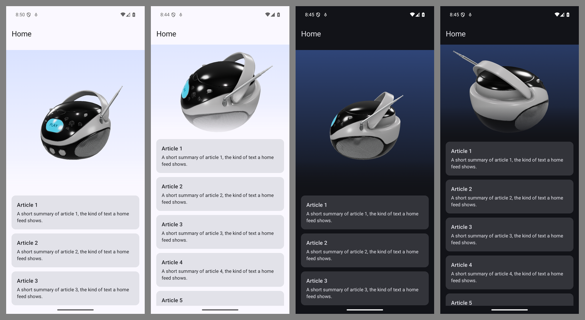

# Prompt: a cinematic 3D hero for your Compose home screen

Paste the block below into your AI coding assistant, from the root of an Android app whose home
screen is a Jetpack Compose `LazyColumn`, `LazyVerticalGrid` or scrolling `Column`. It adds a 3D
hero at the top of the screen: a model that turns slowly, then swings round, rises and moves
closer as you scroll, lags behind the page (parallax) and fades into your content.

The effect is one SceneView composable, `CinematicHero`, available from SceneView 4.44.0. The
prompt only has to place it, which is why it stays short.

## The prompt

```text
Add a cinematic, scroll-driven 3D hero to the top of my app's home screen with SceneView.

1. In the app module: add implementation("io.github.sceneview:sceneview:4.51.0"), set
   compileSdk = 37 (SceneView requires it; keep minSdk and targetSdk), and add
   <uses-permission android:name="android.permission.INTERNET" /> to AndroidManifest.xml.
2. Find the home screen's scrolling list (LazyColumn, LazyVerticalGrid, or Column with
   verticalScroll). Wrap it in a Box with the list's modifier (keep any Scaffold padding on
   the Box), and put io.github.sceneview.CinematicHero in that Box BEFORE the list so it draws
   underneath. Pass the list's state (hoist rememberLazyListState / rememberLazyGridState /
   rememberScrollState into the list if it has none) and height = 420.dp.
3. Make the list's FIRST item a transparent Spacer(Modifier.height(420.dp)); in a grid use
   item(span = { GridItemSpan(maxLineSpan) }). Keep every other item as it is, and give the
   list itself no background, so the hero shows through the spacer.
4. Pass backdrop = Brush.verticalGradient(listOf(MaterialTheme.colorScheme.primaryContainer,
   MaterialTheme.colorScheme.surface)) and this content:
   rememberModelInstance(modelLoader, "https://raw.githubusercontent.com/KhronosGroup/glTF-Sample-Assets/main/Models/BoomBox/glTF-Binary/BoomBox.glb")
       ?.let { ModelNode(modelInstance = it, scaleToUnits = 1f) }
   Import io.github.sceneview.rememberModelInstance; ModelNode needs no import.
5. Write no camera, gesture, animation or scroll code: CinematicHero does all of it. Load
   models only with rememberModelInstance inside the hero's content (Filament runs on the main
   thread). Do not move the Spacer, and do not put the hero inside the list.
6. Run ./gradlew assembleDebug and fix every error before you stop.
```

To use your own model, replace the URL with yours (`https://…` or a path under
`src/main/assets/`) and keep `scaleToUnits = 1f`: with it, any model fits the hero's framing,
whatever its own size, and the hero centres it for you. The boom box is the Khronos glTF sample
[BoomBox](https://github.com/KhronosGroup/glTF-Sample-Assets/tree/main/Models/BoomBox) by
Microsoft, released under CC0 1.0 (public domain), so it is safe to ship while you try the
effect.

## What you should get



- At rest: the model sits in the top 420 dp, over a gradient from your theme, turning slowly.
  Your cards start right under it. The sample model is a 10 MB download, so on first launch the
  gradient shows alone for a few seconds before the model appears.
- While you scroll: the camera swings round about 70°, rises and moves closer, and the whole
  hero moves up slower than the cards. Its bottom edge fades into the page.
- Touches anywhere, the hero included, scroll the list. The hero never catches a drag.
- Once it has scrolled away, it stops drawing. It picks up where it stopped when you scroll back.

## Troubleshooting

| Symptom | Cause and fix |
|---|---|
| Build fails with "requires … compile against version 37" | `compileSdk = 37` in the app module. `minSdk` can stay where it is. |
| `Unresolved reference: CinematicHero` | SceneView is older than 4.44.0. Use 4.44.0 or later. |
| The gradient shows but no model appears | Give the 10 MB download a few seconds. If it never comes: missing `INTERNET` permission, or the device is offline. Check Logcat for the download error. |
| Model tiny or cropped | Keep `scaleToUnits = 1f` on `ModelNode`. For a model that still feels too close or too far, pass `contentRadius` to `CinematicHero`: larger pulls the camera back (default `0.75f`). |
| Blank gap at the top, no 3D | The hero is drawn over by something opaque: the list has a `background`, or the hero was placed after the list in the `Box`. |
| The 3D does not follow the scroll, or overlaps the first card | The `Spacer` is not the list's first item, or its height differs from `height`. |
| In a grid, the hero is squeezed into one column | Give the spacer `span = { GridItemSpan(maxLineSpan) }`. |
| The hero slides under the top app bar | Put the `Scaffold`'s `innerPadding` on the `Box` that holds the hero and the list, not only on the list. |
| The model reloads when you scroll back | The hero was put inside the list. It must be outside, under it. |
| The model does not turn by itself | System animations are off (Developer options or accessibility). The hero then moves only with the scroll, on purpose. |
